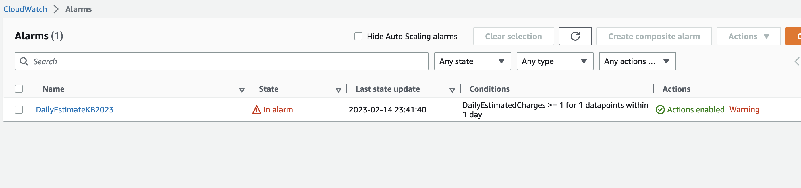
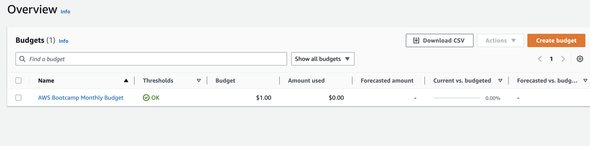
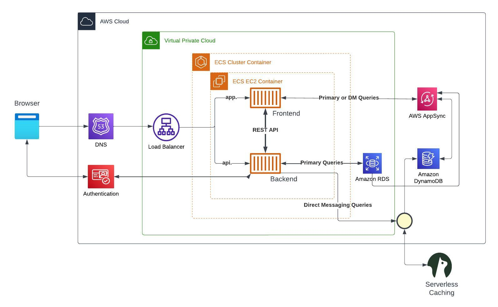
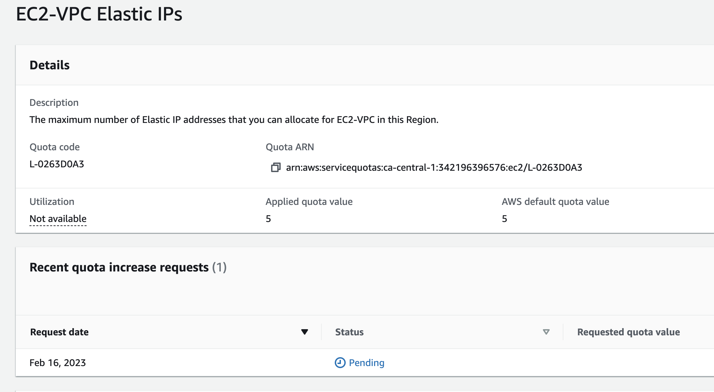

# Week 0 — Billing and Architecture

## Setting up AWS CLI

Updated our .gitpod.yml - Also ran the installation steps from CLI and installed Aws cli manually

```
tasks: 
  - name: aws-cli
    env:
      AWS_CLI_AUTO_PROMPT: on-partial
    init: |
      cd /workspace
      curl "https://awscli.amazonaws.com/awscli-exe-linux-x86_64.zip" -o "awscliv2.zip"
      unzip awscliv2.zip
      sudo ./aws/install
      cd $THEIA_WORKSPACE_ROOT
```

**Created new user and Generated AWS Credentials**
The steps below were used to accomplish this task
- Searched for IAM Users via the home Console
- Created a user for my account
- Enabled console access for the user
- Created a new Admin Group and applied AdministratorAccess
- Created the user and go find and clicked into the user
- Clicked on Security Credentials and Create Access Key
- Chose AWS CLI Access
- Downloaded the CSV with the credentials

EXPORTED the entries:
```
gp env AWS_ACCESS_KEY_ID="KEYID"
gp env AWS_SECRET_ACCESS_KEY="SECRET KEY"
gp env AWS_DEFAULT_REGION=canada-central-1
```

## Enable Billing -- DONE
We need to turn on Billing Alerts to recieve alerts...

In your Root Account go to the Billing Page
Under Billing Preferences Choose Receive Billing Alerts
Save Preferences


    
## CloudWatch alarm:

Created using:
```
aws cloudwatch put-metric-alarm --cli-input-json file://aws/json/alarm_config.json
```

alarm_config.json - checked in

**Proof of Billing Alarm from AWS Console**
[Cloudwatch Billing Alarm ](assets/billing.jfif)



## AWS Budget - DONE
```
aws budgets create-budget
```
Get your AWS Account ID
```
aws sts get-caller-identity --query Account --output text
Supply your AWS Account ID
Update the json files
This is another case with AWS CLI its just much easier to json files due to lots of nested json
aws budgets create-budget \
    --account-id AccountID \
    --budget file://aws/json/budget.json \
    --notifications-with-subscribers file://aws/json/budget-notifications-with-subscribers.json
```

Updated files checked in: budget.json and budget-notifications-with-subscribers.json

**Proof of Budget Creation from AWS Console**



## Logical Diagram:




Homework Challenges

- I have removed the Root account credentials and added MFA to my IAM Role. 
- 


## Quota increase
- There are service limits to AWS services. I have requested a quota increase for EC2-VPC Elastic IPs from 5 to 10
- 
